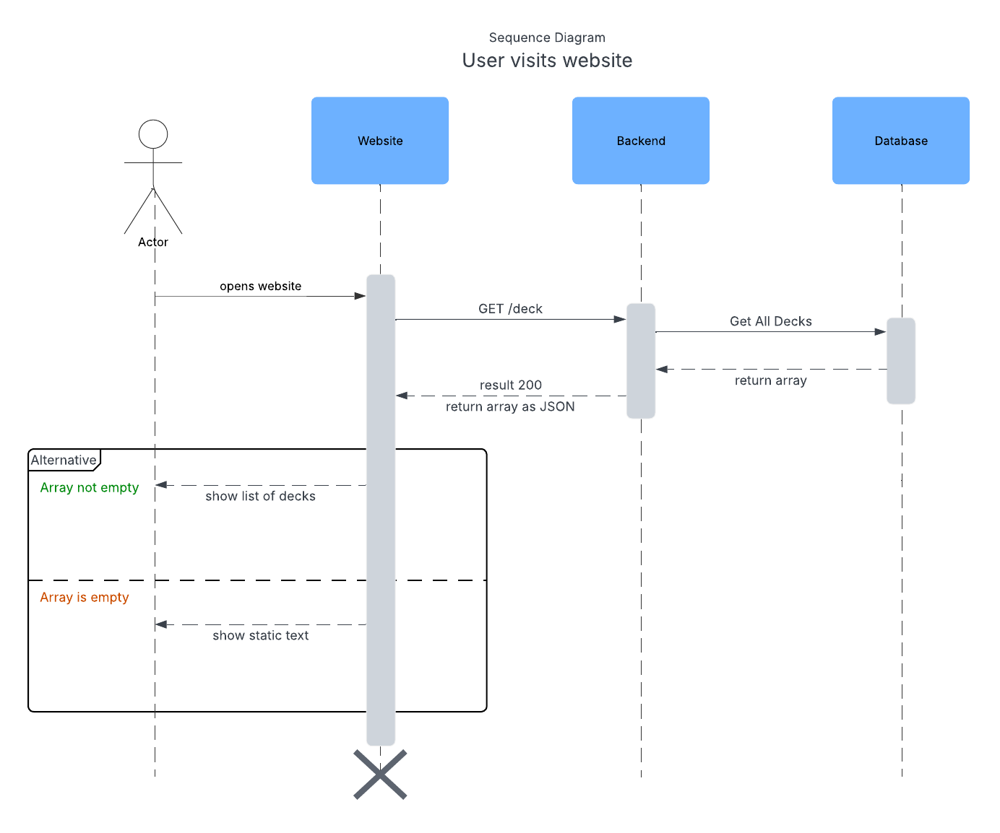
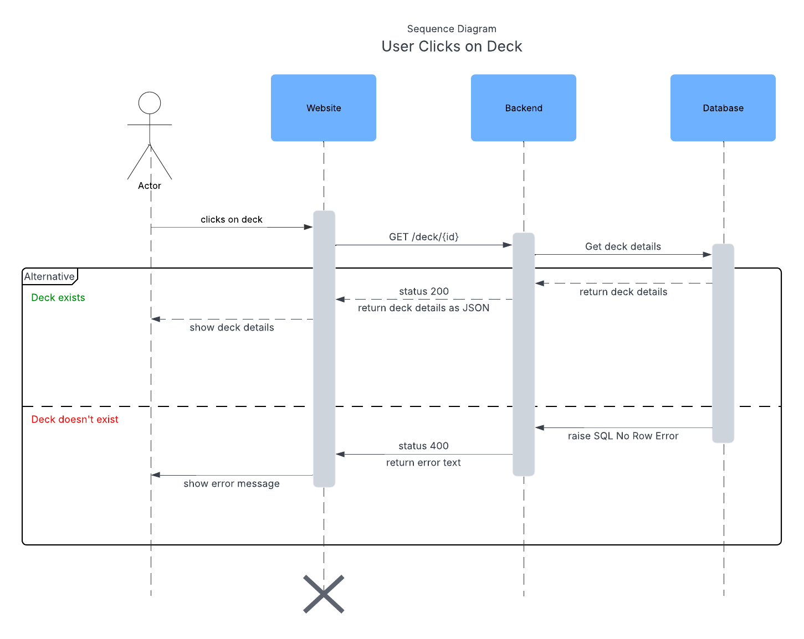
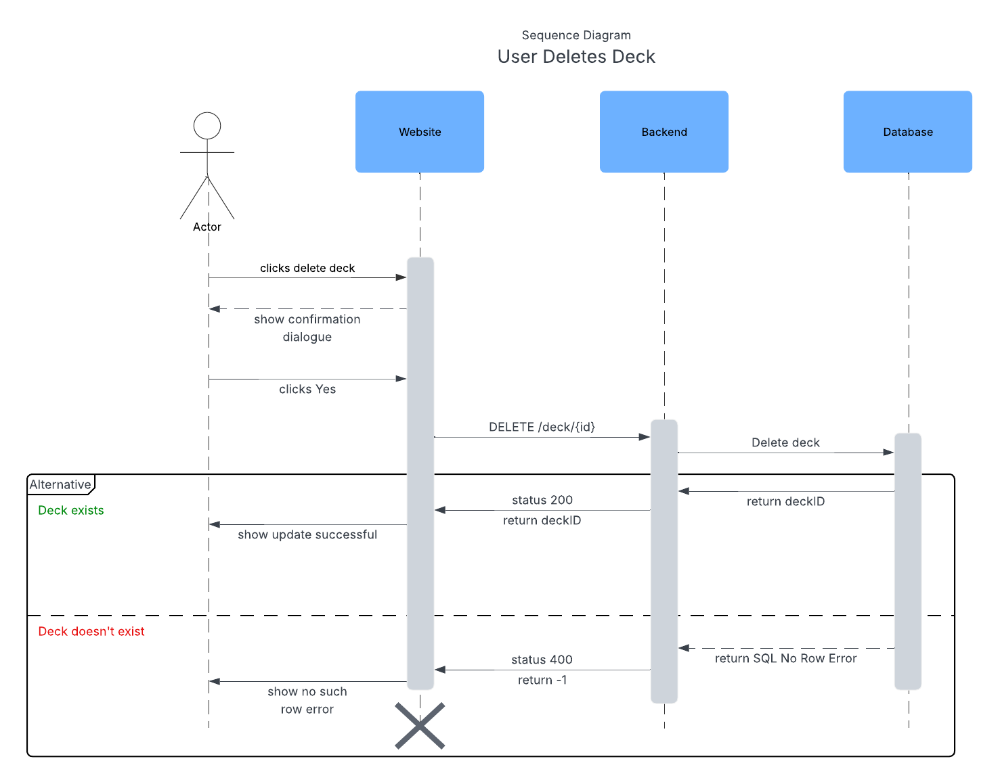

# Deck Interaction

This document outlines how the user might interact with decks and what happens for each interaction.

## User Visits Website

This is the first thing a user sees whenever loading the website, it is the home page. There are two possible scenarios the front end must address:

1. **Empty Deck Array**: If the user has no decks, then a static string should be displayed. The string could say something like **"No decks found"**.
1. **Non-empty Deck Array**: If the user has decks, then an alphabetically sorted list of arrays should be shown.

## User Adds New Deck

This happens when a user is on the home page and clicks on the "add new deck" option. In this case, a form to fill in name and description of the deck should be shown. The form should enforce proper validation set forth by the backend and database. In ase of rule violation, the form should show what the user did wrong.

## User Clicks on Deck

When a user clicks on a deck, more details of the deck will be shown. Typically, a user can do this by clicking on any of the decks shown on the home page. However, a few edge cases need to be considered:

1. **Deck doesn't exist**: This could happen when a user deleted a deck but for whatever reason, the webpage didn't update. This means the deleted deck is still shown and the user attempted to click on this non-existent deck.

1. **Deck exists**: In this case, the website should update the page to show details of the deck.

## User Edits Deck

This happens when a user clicks on the edit icon while on a specific deck's details page. The edge cases here are similar to that of the previous entry. However, there some additional considerations:

1. **Show form**: When asking the user to provide new name and/or description, a form must be shown. This form must perform validations on name and description to make sure it doesn't violate the rules set forth by the database and backend logic. In case of violation, the form must provide clear feedback.

1. **Violation of SQL rules**: One of the rules is that the deck name must be unique. The form should show the user if an entered name violates this rule or not.

## User Deletes Deck

This happens when a user clicks on the delete icon while on a specific deck's details page. The edge cases are similar to that of the edit case with one difference. Instead of showing a form, the UI should show a confirmation dialogue. Preferably one like GitHub's where the user has to enter the name of the deck they are trying to delete.

